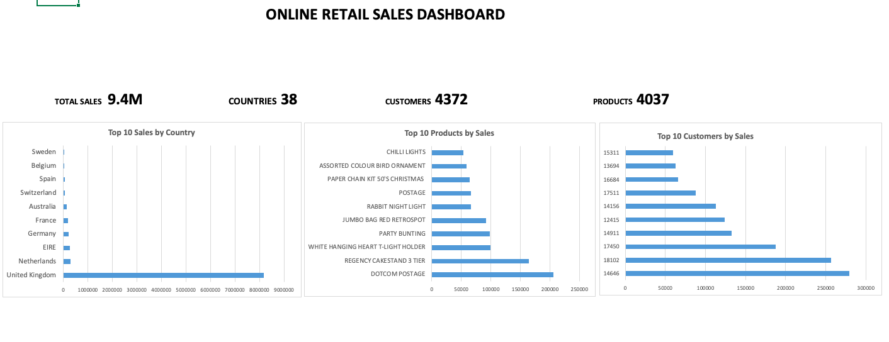

# Online Retail Sales Analysis

## Project Overview

This project analyses a real-world online retail dataset using three different tools: Microsoft Excel, SQL and Python.

The objective was to clean the data, calculate sales, identify the best-performing countries, products and customers and create visualisations to support business decisions.

The same analysis was performed in Excel, SQL, and Python to validate the accuracy of the results.

---

## Dataset

Dataset: Online Retail Dataset

The dataset contains over 540,000 retail transactions from an online gift retailer.

Main columns:
- InvoiceNo
- StockCode
- Description
- Quantity
- InvoiceDate
- UnitPrice
- CustomerID
- Country

---

## Tools Used

- Microsoft Excel
- SQL (SQLite)
- Python
- Pandas
- Matplotlib
- GitHub

---

## Data Cleaning

One of the most important parts of this project was understanding which records represented real sales and which were administrative or incorrect entries.
While exploring the dataset, I found many product descriptions such as:
'incorrect stock', '??missing', 'damaged', 'wet', 'check' or other non-commercial records.
I decided to exclude these entries from the product analysis because they did not represent products that were actually sold to customers.
This decision reduced the number of analysed products to 4,037 unique products, which provides a more accurate view of merchandise sales and customer purchasing behaviour.
I also removed duplicate transactions, handled blank values, and created a new column- Sales using the formula:
Sales = Quantity × UnitPrice

---

## Excel Analysis

Using Microsoft Excel I created:

- Pivot Tables
- KPI Cards
- Sales Dashboard
- Top 10 Countries by Sales
- Top 10 Products by Sales
- Top 10 Customers by Sales

Dashboard preview:

---

## SQL Analysis

The following SQL queries were created:

- Total transactions
- Unique customers
- Top countries by sales
- Top products by sales
- Top customers by sales
- Average sales by country
- Number of transactions by country

The SQL results matched the Excel analysis.

---

## Python Analysis

Python was used to:

- Load the cleaned dataset with Pandas
- Validate the Excel and SQL results
- Calculate Top Countries
- Calculate Top Products
- Calculate Top Customers
- Create visualisations using Matplotlib

During the Python analysis I discovered that the Sales column was imported as a string. I converted it to a numeric (float) data type to perform calculations and create visualisations.

Generated and saved charts:

- Top Countries by Sales
- Top Products by Sales
- Top Customers by Sales

---

## Key Insights

- Total sales exceeded £9.4 million.
- United Kingdom generated by far the highest sales.
- Netherlands and EIRE were the next highest-performing countries.
- DOTCOM POSTAGE generated the highest revenue in data, indicate that shipping costs represents a significant portion of total sales. Excluding the shipping entry, Regency Cakestand 3 Tier was the highest-performing physical product by revenue. 
- The same business insights were confirmed using Excel, SQL, and Python.

---

## Project Structure

online-retail/

data/

excel/

images/

notebooks/

sql/

README.md

---

## Future Improvements

Possible future improvements include:

- Time series sales analysis
- Monthly sales trends
- Customer segmentation
- Interactive Power BI dashboard